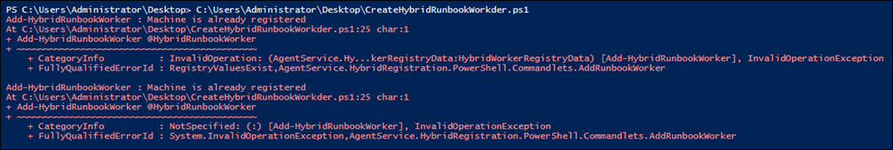
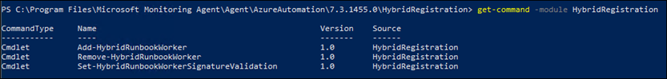

# Chapter 8: Cloud-Based Automation
This chapter provides a brief introduction to Azure Automation.  

## Azure Automation Setup
The [author](https://github.com/mdowst) [presents](https://github.com/mdowst/Practical-Automation-with-PowerShell/blob/main/Chapter08/Snippets.md) several snippets of code that facilitate the setup of components used by Azure Automation. 

### Import required modules
```powershell
Install-Module -Name Az
Install-Module -Name Az.MonitoringSolutions
Import-Module -Name Az,Az.MonitoringSolutions
```

### Set up variables used for creating Azure Automation resources
```powershell
$SubscriptionId = 'The GUID of your Azure subscription'
$DateString = (Get-Date).ToString('yyMMddHHmm')
$ResourceGroupName = 'PoshAutomate'
$WorkspaceName = 'poshauto' + $DateString
$AutomationAccountName = 'poshauto' + $DateString
$StorageAccountName = 'poshauto' + $DateString
$AutomationLocation = 'SouthCentralUS'
$WorkspaceLocation = 'SouthCentralUS'
```

### Connect to the Azure subscription
```powershell
Connect-AzAccount -Subscription $SubscriptionId
```

### Create the resource group 
```powershell
New-AzResourceGroup -Name $ResourceGroupName -Location $AutomationLocation
```

### Create the Log Analytics workspace, Azure Automation account, and storage account
```powershell
$WorkspaceParams = @{
	ResourceGroupName = $ResourceGroupName
	Name              = $WorkspaceName
	Location          = $WorkspaceLocation
}
New-AzOperationalInsightsWorkspace @WorkspaceParams

$AzAutomationAccount = @{
	ResourceGroupName = $ResourceGroupName
	Name              = $AutomationAccountName
	Location          = $AutomationLocation
	Plan              = 'Basic'
}
New-AzAutomationAccount @AzAutomationAccount

$AzStorageAccount = @{
	ResourceGroupName = $ResourceGroupName
	AccountName       = $StorageAccountName
	Location          = $AutomationLocation
	SkuName           = 'Standard_LRS'
	AccessTier        = 'Cool'
}
New-AzStorageAccount @AzStorageAccount
```

### Add the Azure Automation solution to the Log Analytics workspace
```powershell
$WorkspaceParams = @{
	ResourceGroupName = $ResourceGroupName
	Name              = $WorkspaceName
}
$workspace = Get-AzOperationalInsightsWorkspace @WorkspaceParams

$AzMonitorLogAnalyticsSolution = @{
	Type                = 'AzureAutomation'
	ResourceGroupName   = $ResourceGroupName
	Location            = $workspace.Location
	WorkspaceResourceId = $workspace.ResourceId
}
New-AzMonitorLogAnalyticsSolution @AzMonitorLogAnalyticsSolution
```

### Create a managed identity and give it contributor access to the storage account
```powershell
$AzStorageAccount = @{
	ResourceGroupName = $ResourceGroupName
	AccountName       = $StorageAccountName
}
$storage = Get-AzStorageAccount @AzStorageAccount

$AzAutomationAccount = @{
	ResourceGroupName     = $ResourceGroupName
	AutomationAccountName = $AutomationAccountName
	AssignSystemIdentity  = $true
}
$Identity = Set-AzAutomationAccount @AzAutomationAccount

$AzRoleAssignment = @{
	ObjectId           = $Identity.Identity.PrincipalId
	Scope              = $storage.Id
	RoleDefinitionName = "Contributor"
}
New-AzRoleAssignment @AzRoleAssignment
```

For more info on Managed Identities, see
- [Azure Automation account authentication overview](https://docs.microsoft.com/en-us/azure/automation/automation-security-overview?WT.mc_id=Portal-Microsoft_Azure_Automation#managed-identities-preview)
- [What are managed identities for Azure resources?](https://docs.microsoft.com/en-us/azure/automation/automation-security-overview?WT.mc_id=Portal-Microsoft_Azure_Automation#managed-identities-preview)


### Output the keys for the MMA Agent and hybrid worker registration
You will use these keys next when installing the Microsoft Monitoring Agent (MMA) and registering the MMA agent as a hybrid runbook worker. 
```powershell
$InsightsWorkspace = @{
	ResourceGroupName = $ResourceGroupName
	Name              = $WorkspaceName
}
$Workspace = Get-AzOperationalInsightsWorkspace @InsightsWorkspace

$WorkspaceSharedKey = @{
	ResourceGroupName = $ResourceGroupName
	Name              = $WorkspaceName
}
$WorspaceKeys = Get-AzOperationalInsightsWorkspaceSharedKey @WorkspaceSharedKey

$AzAutomationRegistrationInfo = @{
	ResourceGroupName     = $ResourceGroupName
	AutomationAccountName = $AutomationAccountName
}
$AutomationReg = Get-AzAutomationRegistrationInfo @AzAutomationRegistrationInfo
@"
`$WorkspaceID = '$($Workspace.CustomerId)'
`$WorkSpaceKey = '$($WorspaceKeys.PrimarySharedKey)'
`$AutoURL = '$($AutomationReg.Endpoint)'
`$AutoKey = '$($AutomationReg.PrimaryKey)'
"@
```

## Microsoft Monitoring Agent and Hybrid Worker Setup
When executing tasks on-prem, you need to do two things: (1) install the Microsoft Monitoring Agent (MMA) and (2) register the system as a hybrid runbook worker.

The script [Install Microsoft Monitoring Agent.ps1](scripts/1%20-%20Install%20Microsoft%20Monitoring%20Agent.ps1) does several things:
- Downloads the MMA to the user's local temp directory
- Runs the setup.exe for the MMMA
- Registers the Log Analytics workspace with the MMA configuration

**Install Microsoft Monitoring Agent.ps1**
```powershell
# Set the parameters for your workspace
$WorkspaceID = 'YourId'
$WorkSpaceKey = 'YourKey'

# URL for the agent installer
$agentURL = 'https://download.microsoft.com/download' +
    '/3/c/d/3cd6f5b3-3fbe-43c0-88e0-8256d02db5b7/MMASetup-AMD64.exe'

# Download the agent
$FileName = Split-Path $agentURL -Leaf
$MMAFile = Join-Path -Path $env:Temp -ChildPath $FileName
Invoke-WebRequest -Uri $agentURL -OutFile $MMAFile | Out-Null

# Install the agent
$ArgumentList = '/C:"setup.exe /qn ' +
    'ADD_OPINSIGHTS_WORKSPACE=0 ' +
    'AcceptEndUserLicenseAgreement=1"'
$Install = @{
    FilePath     = $MMAFile
    ArgumentList = $ArgumentList
    ErrorAction  = 'Stop'
}
Start-Process @Install -Wait | Out-Null

# Load the agent config com object
$Object = @{
	ComObject = 'AgentConfigManager.MgmtSvcCfg'
}
$AgentCfg = New-Object @Object

# Set the workspace ID and key
$AgentCfg.AddCloudWorkspace($WorkspaceID, 
    $WorkspaceKey)

# Restart the agent for the changes to take effect
Restart-Service HealthService
```

After installing the Microsoft Monitoring Agent (MMA), you then need to register the MMA agent as a hybrid runbook worker.

The script [Create Hybrid Runbook Worker.ps1](scripts/2%20-%20Create%20Hybrid%20Runbook%20Worker.ps1) does the following:
- Looks up the install path for the Microsoft Monitoring Agent
- Imports the module `HybridRegistration.psd1` from the AzureAutomation folder in the install path
- Runs the cmdlet `Add-HybridRunbookWorker`

This script uses the output from the [registration key snippet earlier](#output-the-keys-for-the-mma-agent-and-hybrid-worker-registration) to register the hybrid runbook worker.


```powershell
# Listing 2 - Create Hybrid Runbook Worker
# Set the parameters for your Automation Account
$AutoUrl = ''
$AutoKey = ''
$Group   = $env:COMPUTERNAME

# Find the directory the agent was installed in
$Path = 'HKLM:\SOFTWARE\Microsoft\System Center ' +
    'Operations Manager\12\Setup\Agent'
$installPath = Get-ItemProperty -Path $Path | 
    Select-Object -ExpandProperty InstallDirectory
$AutomationFolder = Join-Path $installPath 'AzureAutomation'

# Search the folder for the HybridRegistration module
$ChildItem = @{
	Path    = $AutomationFolder
	Recurse = $true
	Include = 'HybridRegistration.psd1'
}
Get-ChildItem @ChildItem | Select-Object -ExpandProperty FullName

# Import the HybridRegistration module
Import-Module $modulePath

# Register the local machine with the automation account
$HybridRunbookWorker = @{
	Url       = $AutoUrl
	key       = $AutoKey
	GroupName = $Group
}
Add-HybridRunbookWorker @HybridRunbookWorker


### Issue: Machine is already registered as a hybrid runbook worker
You will receive the following error when running `CreateHybridRunbookWorker` multiple times:



The module `HybridRegistration.psd1` provides an option to remove the registration:



But you need to know the existing registration URL. This URL is not easy to get as there's no `Get-HybridRunbookWorker` cmdlet.

To fix, just delete the registry key `HKLM\Software\Microsoft\HybridRunbookWorker`.

## Managing Modules for Hybrid Runbook Workers
You need to manually manage your PowerShell modules on Hybrid Runbook Workers, as Azure Automation doesn't do that for you.

Be sure to scope module installation to `AllUsers`:

`Install-Module -Name <module name> -Scope AllUsers`
